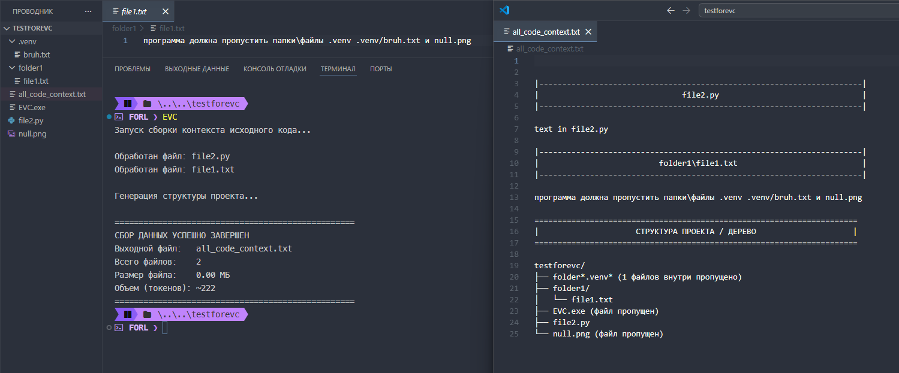

# EzVibeCode (EVC)

Консольная утилита (CLI) на Python позволяет собрать весь исходный код проекта в один текстовый файл для передачи ChatGPT, Claude, Gemini, Qwen и другим LLM без ручного копирования файлов.

##  Основные возможности

* **Умная фильтрация:** Автоматический пропуск бинарных файлов, изображений, системных папок (.git, .venv, .vscode, build, dist) и кэша.
* **Полный контроль (Белые и Черные списки):** Максимально гибкая настройка через изолированный config.json. Скрипт поддерживает фильтрацию как по конкретным директориям, так и по расширениям.
* **Работа с буфером обмена:** Возможность скопировать результат (как текст или как сам физический файл) для мгновенной вставки в чат с нейросетью.
* **Генерация структуры:** В конец выходного файла автоматически добавляется красивое текстовое дерево проекта с подсчетом пропущенных файлов.
* **Статистика сборки:** Вывод итогового размера файла в МБ и приблизительного объема данных в токенах.

---

##  Быстрый старт

### Шаг 1. Загрузка и распаковка
1. Скачайте свежий архив **EVC.zip** со страницы [Releases](https://github.com/xFORL/EzVibeCode/releases/latest).
2. Распакуйте архив в удобное место, например, в `C:\tools\EVC\`.

### Шаг 2. Авто-настройка PATH
1. Зайдите в распакованную папку и запустите утилиту **pathedit.exe**.
2. Следуйте инструкциям на экране. Программа автоматически добавит папку с утилитой в системные переменные окружения.
3. Перезапустите ваш терминал или VS Code.

---

## Как пользоваться

Откройте терминал в папке с вашим целевым проектом и введите команду:

> EVC

Утилита прочитает настройки из глобального `config.json` и создаст файл `all_code_context.txt` прямо в папке вашего проекта.

### Флаги командной строки
Вы можете гибко управлять поведением агрегатора на лету:

* `-ct` или `--copytext` — Скопировать **весь текст** собранного файла в буфер обмена (удобно для вставки прямо в поле ввода ChatGPT/Claude).
* `-cf` или `--copyfile` — Скопировать **сам физический файл** в буфер обмена (удобно для вставки в Telegram/Discord как документ).
* `-fn` или `--filename` — Переопределить имя выходного файла (например, `EVC -fn backend.txt`).
* `-t` или `--trash` — Указать дополнительные файлы или папки для исключения через пробел.
* `-nd` или `--noderevo` — Отключить генерацию дерева структуры проекта в конце файла.

**Комбинированный пример:**

> EVC -fn core_logic.txt -ct -t tests assets README.md

*(Соберет контекст без папок tests и assets, назовет файл core_logic.txt и мгновенно скопирует весь его текст в буфер обмена).*

---

##  Тонкая настройка (config.json)

Вся магия фильтрации находится в файле `config.json`, который лежит рядом с вашим `EVC.exe`. Вы можете открыть его в любом текстовом редакторе и настроить под свой стек технологий:

* **ALLOWED_EXTENSIONS** и **ALLOWED_FILES** — Белые списки (то, что будет прочитано).
* **IGNORE_DIRS**, **IGNORE_FILES** и **IGNORE_EXTENSIONS** — Черные списки (то, что будет строго проигнорировано).

---

##  Сборка из исходников (Для разработчиков)

Если вы хотите скомпилировать проект самостоятельно, вам потребуется PyInstaller.

1. Установите зависимости:
> pip install -r requirements.txt

2. Запустите сборку:
> python -m PyInstaller --onefile -n EVC -i icon.ico main.py
> python -m PyInstaller --onefile -n pathedit -i icon.ico pathedit/pathedit.py