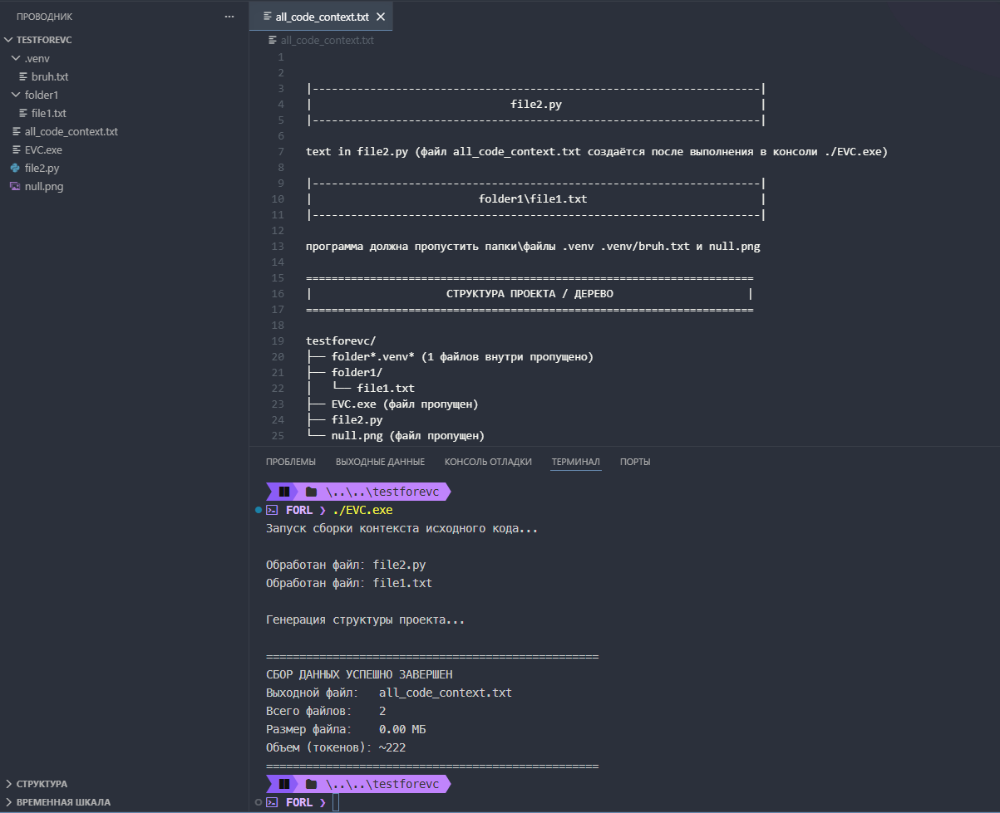

# EzVibeCode (EVC)

Консольная утилита (CLI) на Python для агрегации исходного кода проекта в единый текстовый файл. Предназначена для быстрой передачи контекста кодовой базы в Large Language Models (LLM).

## Основные возможности

* **Умная фильтрация:** Автоматический пропуск бинарных файлов, изображений, системных папок (`.git`, `.venv`, `.vscode`, `build`, `dist`) и кэша.
* **Кастомизация расширений:** Полный список обрабатываемых файлов и исключений вынесен в изолированный текстовый конфигурационный файл `config.json`.
* **Генерация структуры:** В конец выходного файла автоматически добавляется текстовое дерево проекта с подсчетом пропущенных файлов в скрытых директориях.
* **Статистика сборки:** Вывод итогового размера файла в МБ и приблизительного объема данных в токенах.
* **Автономность:** Утилита написана на стандартной библиотеке Python и не требует сторонних зависимостей для работы кодовой базы.

## Демонстрация работы EzVibeCode



## Быстрый старт

**Самый простой способ:** Скачайте готовый автономный файл `EVC.exe` со страницы [GitHub Releases](https://github.com/xFORL/EzVibeCode/releases/latest) и закиньте его в папку с проектом.

### Запуск готового `.exe`
Перенесите скомпилированный файл `EVC.exe` в корень целевого проекта, откройте терминал (PowerShell / CMD) и запустите:
```powershell
.\EVC.exe
```

### Параметры и флаги командной строки
Вы можете гибко управлять процессом сборки контекста прямо из терминала:
* `-t` или `--trash` — исключить дополнительные файлы или папки (через пробел).
* `-nd` или `--noderevo` — отключить генерацию дерева структуры проекта в конце файла.

**Примеры использования с флагами:**
```powershell
# Запуск exe с пропуском папки tests и файла backup.sql
.\EVC.exe -t tests backup.sql

# Запуск без генерации текстового дерева в конце файла
.\EVC.exe -nd
```


## Сборка в автономный исполняемый файл (.exe)

Для компиляции проекта в один независимый исполняемый файл со встроенной конфигурацией используется `PyInstaller`:

1. Установите зависимости из виртуального окружения:
   ```bash
   pip install -r requirements.txt
   ```
2. Запустите компиляцию:
   ```bash
   python -m PyInstaller --onefile --add-data "config.json;." -n EVC -i icon.ico main.py
   ```

Готовый автономный файл появится в директории `dist/EVC.exe`. Вы можете переименовывать его, переносить на другие ПК с ОС Windows и запускать в любых папках — конфигурация останется внутри него.